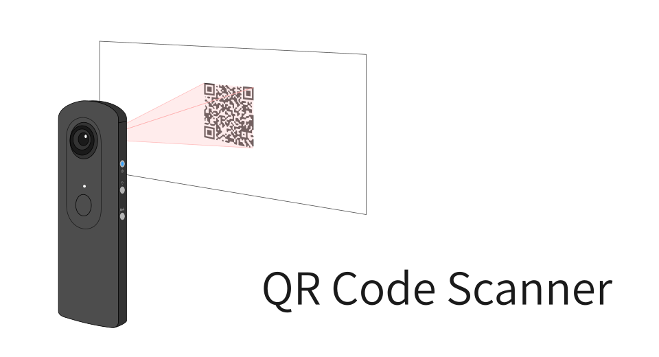
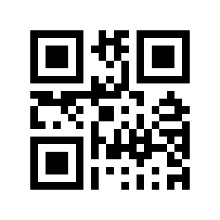

# THETA Plug-in QR Code Scanner

THETA プラグインで QR コードを読むデモ

## 使い方

1. 起動するとすぐにスキャンが開始される
2. 色名の QR コードをスキャンする
    * 対応する色名は `RED`, `GREEN`, `BLUE` の3種類
3. スキャン結果が表示される
    * THETA V では Wi-Fi LED がスキャンした色で点灯する
    * THETA Z1 では OLED にスキャンした色名が表示される
4. シャッターボタンを押すとスキャンが再開される

## ライセンス

This software contains works which are distributed under the Apache License, Version 2.0.

* [ZXing](https://github.com/zxing/zxing)

## テスト用 QR コード

### RED

### GREEN

### BLUE

